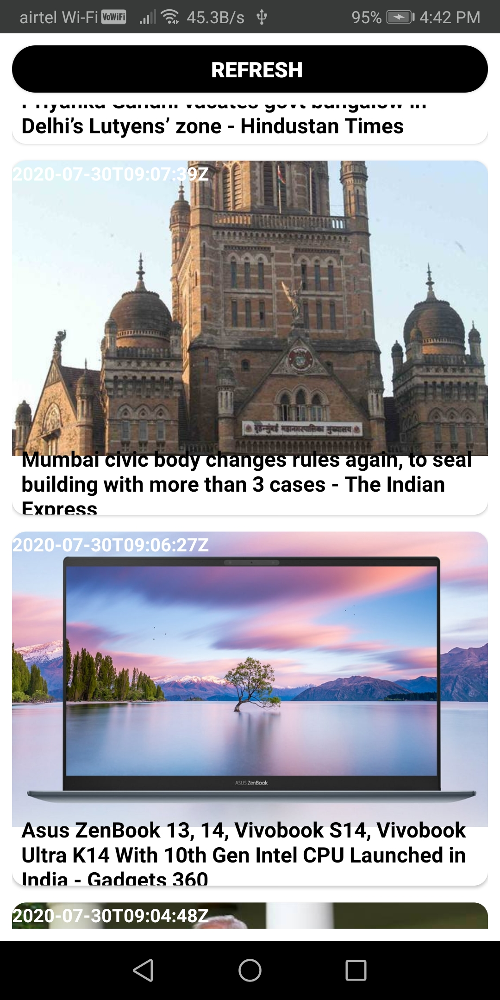

# Description

App Name - **_News App_** 

News app using retrofit and web View.

# Features

1. Display News in RecyclerView 
2. News Fetched Using Retrofit
3. Navigate to browser for viewing news

# What did i learned?

1. Using Retrofit Client
2. Diplay News using Recycler View
3. Image Processing Using [Picasso](https://github.com/square/picasso)
4. Webview

# Dependencies used

1. [Retrofit](https://square.github.io/retrofit/) - for fetching data
3. [Picasso](https://github.com/square/picasso) - for image processig

# Api Used

[newsapi.og](https://newsapi.org/)

# Screenshots

